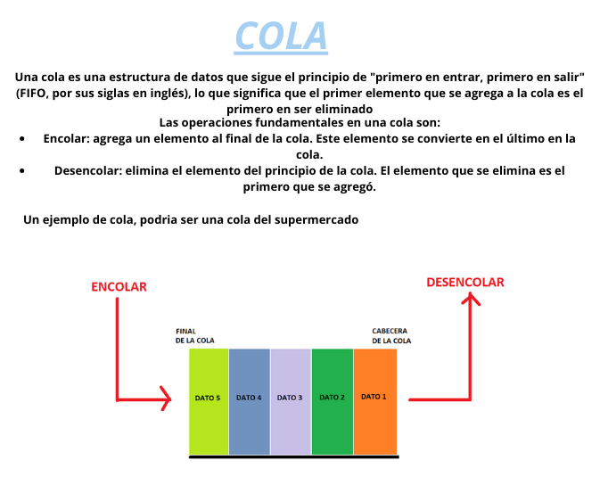

<div align="right">

</div>

# TP/TDA

## Repositorio de Marlene Elizabeth Gimenez Gauto - 110506 - gimenezzeli@gmail.com

- Para compilar:

```bash
gcc src/*.c --leak-check=full --track-origins=yes --show-reachable=yes --error-exitcode=2 --show-leak-kinds=all --trace-children=yes -std=c99 -Wall -Wconversion -Wtype-limits -pedantic -Werror -O2 -g -o lista
```

- Para ejecutar:

```bash
./lista
```

- Para ejecutar con valgrind:
```bash
make valgrind-chanutron
```
---
##  Funcionamiento

Mi struct lista contiene un puntero al nodo_inicio este nos sirve como punto de entrada para acceder a los elementos de la lista, un puntero al nodo_fin que nos sirve para achicar la complejidad algoritmica de algunas funciones y una variable cantidad para saber cuantos elementos hay en mi lista.

Empiezo creando una funcion para crear una lista usando malloc y verifico si la memoria se guardo correctamente, si fue asi devuelvo una lista vacia.

```c
lista_t *lista_crear(){
	lista_t *nueva_lista = malloc(sizeof(lista_t));
	if (!nueva_lista){
		free(nueva_lista);
		return NULL;
	}
	nueva_lista->cantidad = 0;
	nueva_lista->nodo_inicio = NULL;

	return nueva_lista;
}
```
Como voy a necesitar muchos nodos, me cree una funcion que recibe un elemento el cual me sirve para crear un nodo usando malloc y verifico si la memoria se guardo correctamente, si fue asi devuelvo un nodo.  

```c
nodo_t *crear_nodo(void *elemento){
	nodo_t *nuevo_nodo = malloc(sizeof(nodo_t));

	if(!nuevo_nodo){
		free(nuevo_nodo);
		return NULL;
	}

	nuevo_nodo->elemento = elemento;
	nuevo_nodo->siguiente = NULL;

	return nuevo_nodo;
}

```

Si quiero insertar al final, hago las verificaciones correspondientes:
Caso especial: si la lista esta vacia 
Hago que el nodo_inicio y el nodo_fin apunten al nuevo_nodo previamente creado. Y aumento la cantidad de elementos +1. Al finalizar devuelvo la lista.
Otro caso: si la lista no esta vacia
Si  la lista ya tiene nodos dentro hago que el nodo_fin->siguiente apunte al nuevo nodo y cambio el nodo_fin al nuevo_nodo insertado. Y aumento la cantidad de elementos +1. Al finalizar devuelvo la lista.

Si quiero insertar en una posicion en especifico, hago las verificaciones correspondientes (entre ellas esta que si la lista esta vacia o que si la posicion en la que quiero insertar es mayor al tamaño de la lista, el nuevo nodo se insertara al final). 
Caso especial: si la posicion en la que quiero insertar es la posicion 0
Hago que el nuevo_nodo->siguiente apunte al nodo_inicio y cambio el nodo_inicio al nuevo_nodo. Y aumento la cantidad de elementos +1. Al finalizar devuelvo la lista.
Otro caso: si la posicion en la que quiero insertar NO es la primera.
Tengo que recorrer la lista hasta que mi contador (previamente inicializado en 0) sea igual a la posicion dada menos 1, ya que las pociones de a la lista arrancan en 0. Una vez encontrada la posicion hago que el nuevo_nodo->siguiente apunte al nodo_actual->siguiente y despues hago que el nodo_actual->siguiente apunte al nuevo nodo. Aumento la cantidad de elementos +1. Al finalizar devuelvo la lista.

Si quiero eliminar al final, hago las verificaciones correspondientes:
Caso especial:si la lista solo tiene un elemento
Libero al nodo_inicio y hago que el nodo_inicio y el nodo_fin apunten a NULL, despues libero mi nodo_viejo que es un auxiliar. Disminuyo la cantidad de elementos que tiene mi lista -1. 
Otro caso: si l lista tiene mas de un elemento 
Tengo que recorrer la lista hasta llegar al penúltimo nodo, utilizo el nodo_viejo para guardarme el penultimo nodo y nodo_actual para guardarme el ultimo nodo. Me guardo el elemento del ultimo nodo para devolverlo al finalizar. Despues hago que el penultimo nodo es decir el nodo_viejo apunte a NULL y cambio el nodo_fin y apunta al nodo_viejo que va a ser nuestro nuevo fin. Libero el nodo y reduzco el tamaño de la lista. Al finalizar devuelvo el elemento del nodo borrado.

Si quiero eliminar de una posicion en especifico, hago las verificaciones correspondientes:
Caso especial: si la posicion a eliminar es la 0
Hago que el nodo_inicio apunte al nodo_inicio->siguiente; libero los nodos auxiliares, reduzco el tamaño de la lista y devuelvo el elemento del nodo borrado que previamente me guarde.
Caso especial: si la posicion es mayor o igual al tamaño de la lista
Debo eliminar al ultimo, puedo llamar a la funcion lista_quitar que elimina el ultimo y me devuelve el elemento del nodo borrado y este lo guardo en una variable y lo devuelvo al finalizar.
Otro caso: eliminar en una posicion valida
Tengo que recorrer la lista hasta que mi contador (previamente inicializado en 0) sea menor a la posicion dada. Una vez que encontre el nodo de la posicion utilizo el nodo_viejo para guardarme el penultimo nodo y nodo_actual para guardarme el nodo de la posicion. Actulizo el puntero del nodo anterior. Digo que el nodo_viejo->siguiente apunte al nodo_actual->siguiente y nodo_actual->siguiente apunte a NULL. Libero mi nodo_actual, reduzco el tamaño de la lista y devuelvo el elemento del nodo borrado que anteriormente me guarde en una variable.

Si busco un elemento en una posicion dada, debo recorrer mi lista hasta que mi contador inicializado en 0 sea menor a la posicion dada; una vez ahi estoy en el nodo correcto. Devuelvo el elemento de ese nodo.

---

## Respuestas a las preguntas teóricas
 - ¿Qué es una lista/pila/cola? Explicar con diagramas.
<div align="center">

</div>
<div align="center">

</div>
<div align="center">

</div>

 - Explica y analiza las diferencias de complejidad entre las implementaciones de lista simplemente enlazada, doblemente enlazada y vector dinámico para las operaciones:
   - Insertar/obtener/eliminar al inicio
   - Insertar/obtener/eliminar al final
   - Insertar/obtener/eliminar al medio

   Vector dinamico:
    -  Insertar/obtener/eliminar al inicio O(n)
    - Insertar/obtener/eliminar al final O(n)
    - Insertar/obtener/eliminar al medio O(n)
    Lista enlazada:
    -  Insertar/obtener/eliminar al inicio O(1)
    - Insertar/obtener/eliminar al final O(n)
    - Insertar/obtener/eliminar al medio O(n)


- Explica la complejidad de las operaciones implementadas en tu trabajo para la pila y la cola.
    Push y Pop: O(1)
    Ya que 'convierto' mi inicio en el final de mi vector, voy agregando siempre al principio que es O(1) y tambien voy eliminando al primer elemento de mi lista, que en realidad es el ultimo que entro q tambien es O(1)
    Encolar y desencolar: O(1)
    Como tengo un puntero a mi nodo_fin inserto al final siendo este O(1), y desencolar el primer elemento de la lista tambien es O(1)
